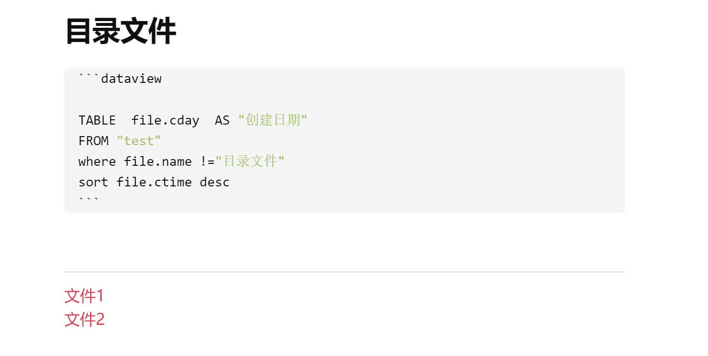

# Obsidian Dataview Linker
Obsidian Dataview Linker是一款用于 Obsidian 的插件，旨在简化和提升与 Dataview 插件兼容的表格内容处理。该插件能够自动将当前文档中 Dataview 表格中的文件路径或文件名转换成 Obsidian 强大的双链链接，便于你在笔记之间轻松跳转和导航,将dataview的查询结果展示在关系图谱中，避免了手动添加的烦恼。
# 功能特点：
自动转换：自动识别 Dataview 表格中的文件路径或文件名，自动将它们转换为 Obsidian 的双链链接。
无缝集成：与 Obsidian 和 Dataview 插件无缝兼容，操作简单。
提高效率：帮助你快速创建双链链接，省去手动编辑和查找链接的繁琐过程。
支持关系图谱: 转换后的内容能在关系图谱中查看关系

# Examples
这里我有一个查询语句，前段是DQL查询结果，后段是linker后的结果，可以在关系图谱中查看

# 注意事项

1. 插件只处理表格类型的查询结果
2. 表格第一列必须命名为 "File",dataview默认是File
3. 每组链接会用 "***" 分隔符标记
4. 链接会自动格式化为 `[[路径|文件名]]` 格式
5. 确保 Dataview 查询语法正确

# 安装方法

1. 下载插件文件
2. 将文件放入 Obsidian 插件文件夹 windows目录在`.obsidian\plugins`
3. 在 Obsidian 设置中启用插件
4. ctrl+p 调用命令面板，输入命令dataviewlinker选择命令执行

## 问题反馈

如果遇到问题或有建议,请访问 [GitHub Issues](https://github.com/Contentsearch/obsidian-dataview-linker/issues) 页面。
